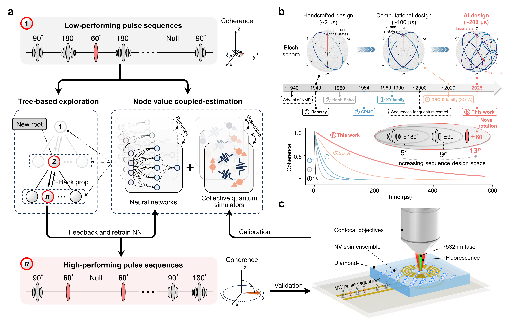

# DOESS
Learning to steer quantum many-body dynamics with artificial intelligence. Data-driven evOlutionary approach to Explore the Sequence Space (DOESS) 

  

## Pseudocode
We present a high-level description of the DAS-AI designed to find the global maximum of an objective function $x^* =$ argmax $f(x)$, $x ∈ X$, where $x$ is the input vector and $X \subseteq \mathbb{R}^N$ is the search space of dimension $N$. The algorithm begins by randomly sampling a dataset $D = \{(x_i, y_i)\}_{i=1}^n \$, where $y_i = f(x_i)$. This dataset is then used to train a data-driven surrogate model $m = \mathbf{Model}(D)$ to fit the distribution of the dataset $D$.

We present a high-level description of Neural-Surrogate-Filtered Tree Exploration (NTE), an algorithm designed to find the global maximum $x^* =$ argmax $f(x)$ subject to constraint functions $g(x) > l$ acting as filters. Here, $x$ denotes an input vector, $X \subseteq \mathbb{R}^d$ is the $d$-dimensional search space, and $l$ is the lower-bound threshold for the constraints. The algorithm begins by randomly sampling an initial dataset $D =$ \{$\(x_i, y_i, z_i)\$\}$\_{i=1}^n\$, where $y_i = f(x_i)$ and $z_i = g(x_i)$. This dataset trains data-driven surrogate models $m = \mathbf{Model}(\{(x_i, z_i)\}_{i=1}^n)\$ to approximate $g(x)$ and serve as feasibility filters.

  

