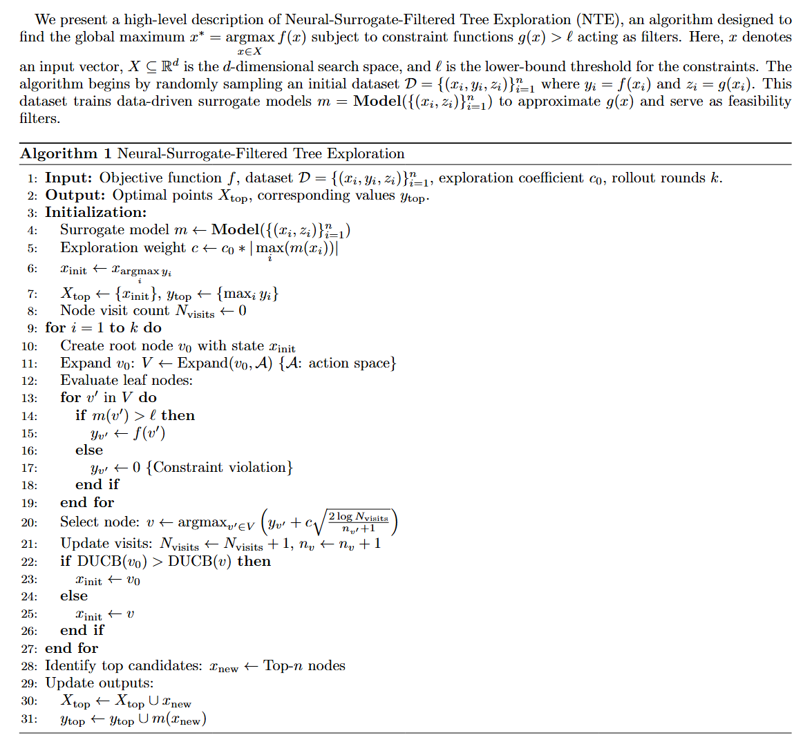

# DOESS
Learning to steer quantum many-body dynamics with artificial intelligence. Data-driven evOlutionary approach to Explore the Sequence Space (DOESS), pipeline showing below:
<p align="center">
  
</p>


## Pseudocode
<p align="center">
  
</p>


# System Requirements
## Hardware requirements
`DOESS` package requires only a standard computer with enough RAM to support the in-memory operations.

## Software requirements
### OS Requirements
This package is supported for *Linux* and *Windows*. The package has been tested on the following systems:
+ Linux: Ubuntu 18.04
+ Windows: Windows 10

### Python Dependencies
`DOESS` mainly depends on the Python scientific stack.

```
dependencies = [
    "numpy>=1.24.3",
    "pandas>=2.3.1",
    "matplotlib>=3.10.5",
    "seaborn>=0.13.2",
    "scikit-learn>=1.7.1",
    "scipy>=1.15.3",
    "tensorflow>=2.11.0",
    "pytest>=7.3.1",
    "tqdm>=4.67.1",
    "openpyxl>=3.1.5",
    "ray>=2.48.0",
    "qutip>=5.2.0",
]
```

## Installation

`DOESS` requires `python>=3.8`. Installation of TensorFlow and Keras with CUDA support is strongly recommended. It typically takes a few minutes to finish the installation on a `normal` desktop computer.

To install DOESS, run:

```bash
pip install git+https://github.com/Bop2000/DOESS.git
```

Alternatively, you can clone the repository and install it locally:

```bash
git clone https://github.com/Bop2000/DOESS
cd DOESS
pip install -e .
```

## Running Tests

To run tests for DOESS, execute the following command in the project root directory:

```bash
python -m pytest -m "not slow"
```


## DOESS optimization

Here's a detailed example of how to use DOESS:

```python
import numpy as np
import pandas as pd
import os
from tensorflow import keras
import matplotlib.pyplot as plt
import seaborn as sns
import random
import math

from sim.simulation import simulator as Simulator
from sim.objectives import fit_exponential

from doess.utils import load_data,get_initial_points
from doess.objective_func import HamEngineering
from doess.neural_surrogate import IndicatorSurrogateModel
from doess.tree_exploration import TreeExploration


# Define parameters
NUM_DIMENSIONS = 24
NUM_INITIAL_SAMPLES = 2000
NUM_ACQUISITIONS = 10000

# Set the seed for reproducibility
seed = 1
random.seed(1)
np.random.seed(1)


############### Generate initial samples or Load pre-generated data #################
"""Load pre-generated data"""
path1 = 'data/init_dataset'

"""
    input_x (np.ndarray): integer encoding.
    input_x2 (np.ndarray): pulse matrices.
    input_y (np.ndarray): simplified simulator scores.
    input_y2 (np.ndarray): performance indicators.

"""

input_x, input_x2, input_y, input_y2 = load_data(
    path1 = path1
    )


############## Initialise the objective function ##############
path = 'configurations'
file = 'configN2'
sim = Simulator(file, path)
sim.print_info()

obj_function = HamEngineering(
    dims = NUM_DIMENSIONS, 
    repetition = 800,
    objective = 'arithmetic_mean',
    file_path = path,
    file_name= file,
    )


############## Initialise the surrogate model ##############
"""
Attributes for IndicatorSurrogateModel:
    input_dims (int): The input dimensions for the model.
    learning_rate (float): The learning rate for the optimizer.
    path (str): Where to save the trained mdoels.
    batch_size (int): The number of samples per gradient update.
    epochs (int): The number of epochs to train the model.
    patience (int): Number of epochs with no improvement after which training will be stopped.
"""
# create a file to save model prediction results and model performance
pd.DataFrame(np.empty(0)).to_csv(path1 +'/model_performance.csv') 

# surrogate model for performance indicator #1
surrogate1 = IndicatorSurrogateModel(
    indicator = 1,
    input_dims = input_x2.shape[1:], 
    path = path1,
    verbose = True,
    )

# surrogate model for performance indicator #2
surrogate2 = IndicatorSurrogateModel(
    indicator = 2,
    input_dims = input_x2.shape[1:], 
    path = path1,
    verbose = True,
    )

# surrogate model for performance indicator #3
surrogate3 = IndicatorSurrogateModel(
    indicator = 3,
    input_dims = input_x2.shape[1:], 
    path = path1,
    verbose = True,
    )


# Get the starting point for optimization
initial_X,initial_y = get_initial_points(
    input_x, input_y, input_y2,
    np.array([obj_function.threshold[f'#{i+1}'] for i in range(5)])
    )

# Main optimisation loop
for i in range(math.ceil(NUM_ACQUISITIONS/100/NUM_DIMENSIONS)):
    # Train surrogate model and create tree explorer
    cnn1 = surrogate1(input_x2, input_y2[:,0])
    cnn2 = surrogate2(input_x2, input_y2[:,1])
    cnn3 = surrogate3(input_x2, input_y2[:,2])
    
    obj_function.model1 = surrogate1
    obj_function.model2 = surrogate2
    obj_function.model3 = surrogate3

    tree_explorer = TreeExploration(
        func=obj_function, 
        rollout_round=100
        )
    
    # Perform tree exploration to find promising samples
    new_x, new_x2, new_y, new_y2 = tree_explorer.rollout(
        initial_X,initial_y
        )

    # Update dataset with new samples
    input_x2 = np.concatenate((input_x2, new_x2), axis=0)
    input_y2 = np.concatenate((input_y2, new_y2), axis=0)

    # Update initial data point of next iteration of rollouts
    initial_X = obj_function.tracker._current_best_x
    initial_y = obj_function.tracker._current_best
    
    obj_function.tracker._print_status()
```

## License

The source code is released under the MIT license, as presented in [here](LICENSE).
